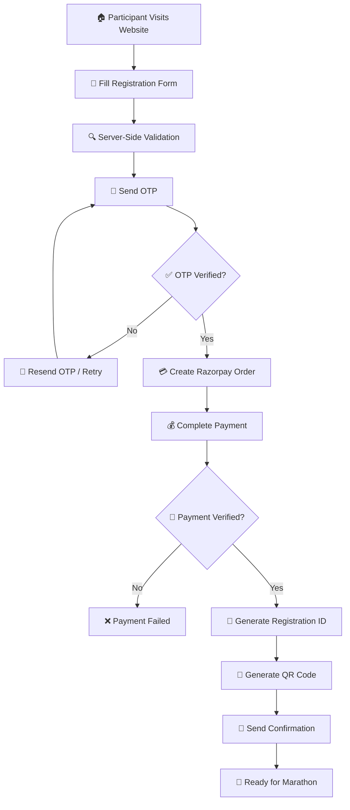

# 🏃 Marathon Live Registration Platform

<p align="center">
  
  
  
  
  
</p>

<p align="center">
  <strong>A secure, modern, and feature-rich PHP-based marathon registration and event management platform.</strong>
</p>

<p align="center">
  <a href="#-demo-video">🎥 Demo</a> •
  <a href="#-features">✨ Features</a> •
  <a href="#-screenshots">📸 Screenshots</a> •
  <a href="#-installation">⚙️ Installation</a> •
  <a href="#-security">🔐 Security</a>
</p>

---

## 🌟 Project Overview

**Marathon Live Registration Platform** is a complete PHP-based event registration and participant management system designed for marathon organizers.

The platform provides a seamless registration experience for participants, including **email OTP verification, secure Razorpay payments, automatic QR code generation, and digital entry passes**.

On the administrative side, organizers can manage participants, monitor payments, validate QR codes during check-in, export participant data, and analyze registration statistics through an interactive dashboard.

The system is built with a strong focus on:

* 🔒 Security
* ⚡ Performance
* 📱 Responsive design
* 💳 Secure payment processing
* 📧 Email verification
* 🎟️ Digital entry passes
* 📊 Admin analytics
* 📷 QR-based event check-in

---

# 🎥 Demo Video

<p align="center">
  <a href="https://www.youtube.com/watch?v=YOUR_VIDEO_ID">
    
  </a>
</p>

<p align="center">
  <strong>▶️ Click the preview above to watch the full project demonstration.</strong>
</p>

### 🎬 Demo Includes

* 🏠 Public landing page
* 📝 Participant registration
* 📧 Email OTP verification
* 🔄 OTP resend and attempt limits
* 💳 Razorpay payment process
* 🎟️ Registration ID generation
* 📱 QR code generation
* 👨‍💼 Admin login
* 📊 Admin analytics dashboard
* 👥 Participant management
* 💰 Payment tracking
* 📷 QR code check-in validation
* 📁 CSV participant export

> **Tip:** Replace `YOUR_VIDEO_ID` with your actual YouTube video ID.

---

# ✨ Key Features

## 🏠 Public Registration

Participants can register for the marathon through a user-friendly and responsive registration interface.

* Participant information collection
* Server-side validation
* Duplicate registration prevention
* Unique registration ID generation
* Mobile-friendly registration experience

---

## 📧 Email OTP Verification

The platform verifies participant email addresses before completing registration.

### OTP Security

* Secure OTP generation
* Hashed OTP storage
* OTP expiration
* Resend OTP functionality
* Maximum verification attempts
* Rate limiting protection

The email system is powered by **PHPMailer** and supports SMTP-based email delivery.

---

## 💳 Razorpay Payment Integration

Participants can securely complete registration payments through Razorpay.

### Payment Flow

```text
Participant Registration
        │
        ▼
Email OTP Verification
        │
        ▼
Create Razorpay Order
        │
        ▼
Complete Payment
        │
        ▼
Verify Payment Signature
        │
        ▼
Update Payment Status
        │
        ▼
Generate Registration ID
        │
        ▼
Generate QR Entry Pass
```

The system tracks:

* Payment attempts
* Razorpay order ID
* Razorpay payment ID
* Payment status
* Payment verification
* Completed registrations

---

## 🎟️ Automatic QR Code Generation

After successful registration and payment, the system generates a unique QR code for the participant.

The QR code can be used for:

* Event check-in
* Participant verification
* Entry validation
* Registration lookup

QR payloads are digitally signed using a secret key to help prevent tampering.

---

## 👨‍💼 Admin Dashboard

The admin dashboard provides centralized control over the marathon event.

### Dashboard Analytics

Administrators can monitor:

* Total registrations
* Verified participants
* Completed payments
* Pending payments
* Failed payment attempts
* Check-in statistics

Interactive charts are implemented using **Chart.js**.

---

## 👥 Participant Management

Administrators can:

* View participants
* Search participants
* Filter participants
* View registration details
* Check payment status
* Manage participant records
* Track check-in status

---

## 📷 QR Scanner & Check-In

The integrated QR scanner allows event staff to validate participant entry passes.

### Check-In Process

```text
Scan QR Code
     │
     ▼
Validate QR Signature
     │
     ▼
Find Registration
     │
     ▼
Check Payment Status
     │
     ▼
Check Previous Entry
     │
     ▼
Approve / Reject Check-In
```

This helps prevent:

* Invalid QR codes
* Tampered entry passes
* Duplicate check-ins
* Unpaid participant entries

---

## 📁 CSV Export

Administrators can export participant data for offline reporting and event management.

Exported information may include:

* Registration ID
* Participant name
* Email
* Phone number
* Category
* Payment status
* Registration date
* Check-in status

---

# 🛠️ Tech Stack

| Technology               | Purpose               |
| ------------------------ | --------------------- |
| 🐘 PHP 8.x               | Backend application   |
| 🗄️ MySQL / MariaDB      | Database              |
| 📦 Composer              | Dependency management |
| 🎨 Bootstrap 5           | Responsive UI         |
| 📊 Chart.js              | Dashboard analytics   |
| 📧 PHPMailer             | Email & SMTP          |
| 🔳 chillerlan/php-qrcode | QR code generation    |
| 💳 Razorpay              | Online payments       |
| 🌐 Apache / Nginx        | Web server            |
| 🖥️ Laragon / XAMPP      | Local development     |

---

# 📂 Project Structure

```text
marathon-live-registration/
│
├── api/
│   ├── register.php
│   ├── verify-otp.php
│   ├── resend-otp.php
│   ├── create-order.php
│   ├── verify-payment.php
│   └── ...
│
├── admin/
│   ├── login.php
│   ├── dashboard.php
│   ├── participants.php
│   ├── payments.php
│   ├── qr-scanner.php
│   ├── export.php
│   └── ...
│
├── includes/
│   ├── config.php
│   ├── db.php
│   ├── auth.php
│   ├── helpers.php
│   └── mailer.php
│
├── setup/
│   └── setup.php
│
├── uploads/
│   └── qrcodes/
│
├── logs/
│   ├── mail.log
│   └── ...
│
├── index.php
├── composer.json
├── composer.lock
└── README.md
```

---

# 🔄 Complete Registration Workflow



> GitHub automatically renders Mermaid diagrams in supported Markdown contexts.

---

# 🔐 Security

Security is a core part of the application architecture.

### Implemented Security Measures

* ✅ Prepared SQL statements
* ✅ SQL injection prevention
* ✅ CSRF protection
* ✅ Server-side input validation
* ✅ Secure password hashing
* ✅ Hashed OTP storage
* ✅ OTP expiration
* ✅ OTP attempt limits
* ✅ Secure session cookies
* ✅ Session hardening
* ✅ Razorpay payment signature verification
* ✅ Signed QR payloads
* ✅ Duplicate check-in prevention
* ✅ Authentication-protected admin routes

---

# ⚙️ Installation

## 1️⃣ Clone the Repository

```bash
git clone https://github.com/YOUR_USERNAME/marathon-live-registration.git
```

Navigate to the project:

```bash
cd marathon-live-registration
```

---

## 2️⃣ Install Composer Dependencies

```bash
composer install
```

---

## 3️⃣ Create the Database

Run the setup script:

```bash
php setup/setup.php
```

Alternatively, initialize the database through your preferred MySQL administration tool.

---

## 4️⃣ Configure Application Settings

Open:

```text
includes/config.php
```

Configure:

```php
// Database
DB_HOST
DB_NAME
DB_USER
DB_PASS

// SMTP
SMTP_HOST
SMTP_PORT
SMTP_USERNAME
SMTP_PASSWORD

// Razorpay
RAZORPAY_KEY_ID
RAZORPAY_KEY_SECRET

// QR Security
QR_SECRET_KEY
```

---

## 5️⃣ Configure Web Server

Place the project inside your local server directory.

### Laragon

```text
C:/laragon/www/marathon-live-registration
```

### XAMPP

```text
C:/xampp/htdocs/marathon-live-registration
```

Start:

* Apache
* MySQL

Then open:

```text
http://localhost/marathon-live-registration/
```

---

# 🧪 Development Mode

The platform supports development-friendly fallback behavior.

### SMTP Not Configured

If SMTP credentials are unavailable, email messages can be logged locally:

```text
logs/mail.log
```

### Razorpay Credentials Not Configured

The payment module can operate in local/development simulation mode.

> ⚠️ Development simulation must not be used for production payments.

---

# 📸 Screenshots

## 🏠 Landing Page

<p align="center">
  
</p>

---

## 📝 Registration Form

<p align="center">
  
</p>

---

## 📧 OTP Verification

<p align="center">
  
</p>

---

## 💳 Payment Page

<p align="center">
  
</p>

---

## 📊 Admin Dashboard

<p align="center">
  
</p>

---

## 📷 QR Scanner

<p align="center">
  
</p>

> Replace the screenshot paths with your actual project screenshots.

---

# 🎞️ Animated Preview

You can add an animated GIF demonstration to your README:

<p align="center">
  
</p>

Recommended GIF flow:

```text
Landing Page
      ↓
Registration
      ↓
OTP Verification
      ↓
Payment
      ↓
QR Pass
      ↓
Admin Dashboard
      ↓
QR Check-In
```

Store your GIF at:

```text
docs/demo/marathon-demo.gif
```

---

# 📊 System Architecture

```text
                    ┌─────────────────────┐
                    │     Participant     │
                    └──────────┬──────────┘
                               │
                               ▼
                    ┌─────────────────────┐
                    │    PHP Frontend     │
                    │   Bootstrap 5 UI    │
                    └──────────┬──────────┘
                               │
                               ▼
                    ┌─────────────────────┐
                    │     PHP Backend     │
                    │   Validation & API   │
                    └──────┬──────┬───────┘
                           │      │
              ┌────────────┘      └────────────┐
              ▼                                ▼
      ┌───────────────┐                ┌───────────────┐
      │ MySQL Database│                │   PHPMailer   │
      └───────────────┘                └───────────────┘
              │                                │
              │                                ▼
              │                         📧 Email OTP
              │
              ▼
      ┌───────────────┐
      │   Razorpay    │
      │ Payment API   │
      └───────┬───────┘
              │
              ▼
      ┌───────────────┐
      │ QR Generation │
      └───────┬───────┘
              │
              ▼
      ┌───────────────┐
      │ Admin Scanner │
      │  & Check-In   │
      └───────────────┘
```

---

# 🚀 Future Enhancements

* [ ] SMS OTP verification
* [ ] WhatsApp registration notifications
* [ ] Multiple marathon categories
* [ ] Participant certificate generation
* [ ] Automated race result integration
* [ ] Live race tracking
* [ ] Bib number generation
* [ ] Advanced reporting system
* [ ] Excel export
* [ ] Multi-admin role management
* [ ] REST API integration
* [ ] Docker deployment
* [ ] Cloud storage for QR codes
* [ ] PWA support

---

# 💡 Use Cases

This platform can be adapted for:

* 🏃 Marathon events
* 🚴 Cycling competitions
* 🏊 Swimming events
* 🏆 Sports tournaments
* 🎪 Community events
* 🎓 College events
* 🏢 Corporate events
* 🎫 Paid event registrations

---

# 📈 Project Highlights

```text
🔐 Secure Authentication
📧 OTP Email Verification
💳 Razorpay Payment Integration
🎟️ Digital Registration Pass
🔳 Signed QR Codes
📷 QR Check-In System
📊 Real-Time Admin Analytics
👥 Participant Management
📁 CSV Data Export
📱 Responsive Design
```

---

# 🤝 Contributing

Contributions are welcome!

1. Fork the repository
2. Create a feature branch

```bash
git checkout -b feature/your-feature
```

3. Commit your changes

```bash
git commit -m "Add new feature"
```

4. Push the branch

```bash
git push origin feature/your-feature
```

5. Open a Pull Request

---

# 📄 License

This project is licensed under the **MIT License**.

---

# 👨‍💻 Developer

<p align="center">
  Developed with ❤️ using PHP, MySQL, Bootstrap, Razorpay, and modern web technologies.
</p>

<p align="center">
  ⭐ If you find this project useful, consider giving it a star!
</p>

---

<p align="center">
  
</p>
